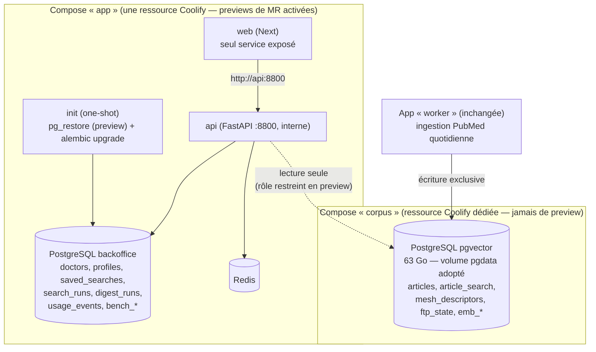

# Refonte infra — deux composes Coolify + previews de MR complètes

*Plan consolidé du 2026-07-24, co-élaboré Claude + Codex (deux passes de revue croisée).*

**En une phrase** : regrouper front + API + base backoffice dans un seul docker-compose
Coolify (avec les previews de MR activées dessus), et isoler la base articles PubMed
dans un compose séparé partagé en lecture seule — pour qu'une MR déploie enfin un
environnement complet et jetable au lieu d'un front branché sur la prod.

---

## 1. État actuel

| Composant | Comment il tourne | Géré par Coolify ? |
|---|---|---|
| Front Next (`:3003` → domaine public) | App Coolify (build nixpacks) | ✅ |
| API FastAPI (`:8800`) | App Coolify (Dockerfile, publie `8800:8800`) | ✅ |
| Worker d'ingestion PubMed | App Coolify (Dockerfile.worker, Scheduled Task 05:00 UTC) | ✅ |
| PostgreSQL (pgvector, **63 Go / 26 M articles**) | `docker compose` artisanal sur l'hôte | ❌ |
| Redis | `docker compose` artisanal sur l'hôte | ❌ |

Particularités structurantes :

- **Une seule base `xmed`** contient tout : les articles PubMed (gros volume, ingéré
  quotidiennement) *et* les données « backoffice » (médecins, profils, recherches,
  digests, usage). Dev et prod partagent **la même** base.
- Le front appelle l'API via **`10.0.1.1:8800` figé au build** (rewrite Next dans
  `nixpacks.toml`) — l'IP hôte vue depuis le réseau Docker Coolify.
- L'API bind-monte **`~/.codex`** (auth du CLI codex) en lecture-écriture.
- **Un seul historique Alembic** (monolithique), une seule connexion SQLAlchemy
  (`app/db.py`).

## 2. Pourquoi ce n'est pas satisfaisant

1. **Les previews de MR sont trompeuses.** La feature Coolify « Preview Deployments »
   ne déploie que le front : la preview pointe vers **l'API de prod et la base de
   prod**. Impossible de tester un changement d'API ou une migration ; et une preview
   peut écrire dans les données de prod.
2. **Déploiements front/API non atomiques.** Incident vécu (merge PR #38) : build front
   OK, build API échoué → la prod a tourné avec un front neuf sur une API ancienne.
   Toute MR qui ajoute un endpoint casse la prod tant que l'API n'est pas redéployée.
3. **L'URL API figée au build** (`10.0.1.1:8800`) interdit toute topologie par
   environnement : une preview de front ne peut pas pointer vers « son » API.
4. **db et redis sont invisibles pour Coolify.** Personne ne les relève proprement au
   reboot de l'hôte → crashs Postgres / recovery WAL, site fragile (cause racine
   documentée dans `DEPLOY_BACKEND_COOLIFY.md`).
5. **Pas de frontière entre données froides et données métier.** Impossible de cloner
   « la base » pour un environnement de test : elle pèse 63 Go alors que les données
   backoffice utiles pèsent quelques Mo.

## 3. Cible

### 3.1 Topologie

- **Compose « corpus »** : la base articles, seule dans son compose. Écrite uniquement
  par le worker d'ingestion. Volume `pgdata` existant **adopté tel quel** (on ne migre
  pas 63 Go). Historique Alembic propre (`alembic/corpus/`).
- **Compose « app »** : front + API + base backoffice + Redis + un service `init`
  one-shot. C'est **cette ressource** qui porte la feature Coolify « Preview
  Deployments » : chaque MR déploie le stack complet, avec sa propre base backoffice,
  détruit à la fermeture de la MR. Historique Alembic propre (`alembic/backoffice/`).
- **Worker** : app Coolify séparée, inchangée. Jamais dupliqué par MR, pas de
  scheduler en preview.

Élégance clé : dans un compose, `api` est un nom DNS stable. Le front peut baker
`http://api:8800` au build — en prod comme dans chaque preview, il pointe
automatiquement vers *son* API. Le problème `10.0.1.1:8800` disparaît.

### 3.2 Prod vs preview — même compose, variables scopées

Coolify permet des valeurs de variables différentes pour les previews. Le compose est
identique partout ; seules les variables changent :

| Variable | Production | Preview de MR |
|---|---|---|
| `CORPUS_DATABASE_URL` | rôle lecture/écriture | rôle **`xmed_preview_ro`** : `CONNECT` + `SELECT` uniquement, `statement_timeout`, limite de connexions |
| Email (Resend) | clé prod | **clé de test / sink imposé par le credential** — jamais la clé prod (un flag applicatif ne suffit pas : le code d'une PR peut l'ignorer) |
| Appels LLM | budget normal | plafonds stricts |
| Auth codex (`~/.codex`) | bind-mount actuel | **jamais monté** — auth dédiée plafonnée ou fonctionnalité désactivée (c'est un credential prod complet, lisible/altérable par le code d'une PR) |

### 3.3 Frontière de données — règle de placement

- **Corpus** : tout ce qui décrit un article dans l'absolu (métadonnées, embeddings,
  état d'ingestion). Écrit par l'ingestion seule.
- **Backoffice** : tout ce que l'API écrit (utilisateurs, profils, recherches,
  digests, usage, évaluations).
- Références inter-bases par **PMID nu** (vérifié : aucune FK ne traverse la
  frontière). Les digests stockent un **snapshot des champs affichés** pour ne pas
  dépendre éternellement de l'état courant du corpus.

⚠️ L'absence de FK ne suffit pas (trouvé par la revue Codex, vérifié dans le code) :
il existe des **jointures SQL traversantes** — `eval_pool JOIN articles LEFT JOIN
article_fr` dans `app/api/eval.py` — et un seul engine SQLAlchemy. Le split exige un
audit des jointures/transactions et leur remplacement par des fusions côté Python,
plus une classification explicite de `article_fr`, `eval_pool`, `eval_annotations`,
`emb_medcpt`, `emb_bge_m3` (voir § 6, décisions préalables).

## 4. Workflows cibles

### 4.1 MR / preview

1. Push d'une branche → ouverture de MR → Coolify déploie **le stack complet** en
   preview (`N.x-med.ia-do-it.com`).
2. Le service `init` restaure le **dump backoffice de la veille** dans la base fraîche
   de la MR, puis joue `alembic upgrade head` — **les migrations de la branche sont
   testées sur des données de forme prod avant merge**.
3. Ajout du domaine de preview aux domaines autorisés Firebase (pas de wildcard
   possible côté Firebase — à automatiser, l'outillage existe).
4. Review sur un environnement complet et isolé (le corpus est partagé, en lecture
   seule) ; les pushes suivants de la MR redéploient sans re-restaurer (volume
   persistant, migrations rejouées seulement).
5. Fermeture/merge de la MR → Coolify détruit conteneurs **et volume**.

### 4.2 Déploiement prod

Push sur `main` → le compose app se redéploie **atomiquement** (front + API + init
ensemble — fini le front neuf sur API ancienne). `init` joue les migrations
backoffice. Les migrations **corpus** sont un job explicite séparé, en
expand/contract, jamais déclenché par une preview.

### 4.3 Backup quotidien (= seed des previews)

Scheduled Task Coolify sur le stack prod : `pg_dump` de la base backoffice. **Un seul
mécanisme** couvre le backup prod et la source de clonage des previews. Durcissements
(revue Codex) :

- écrire vers `backoffice-<timestamp>.dump.tmp`, vérifier le code retour,
  `pg_restore --list`, checksum, puis **rename atomique** — jamais de redirection
  directe vers `latest.dump` (le shell tronquerait l'ancien bon dump avant même que
  `pg_dump` démarre) ;
- `latest.dump` = lien/copie atomique vers le dernier snapshot **validé** ;
- **plusieurs générations conservées + une copie hors machine** (un dump unique sur le
  même hôte n'est pas un backup) ;
- test périodique d'une vraie restauration ;
- RPO de 24 h assumé explicitement.

### 4.4 Restore en preview (service `init`)

- Base créée depuis `template0`, restore `--exit-on-error --single-transaction
  --no-owner --no-acl` (tout-ou-rien garanti par Postgres).
- Marqueur `bootstrap_complete` : s'il manque au redémarrage, on supprime/recrée la
  base avant de recommencer (« la base contient des tables » n'est pas un critère).
- Le dump est monté en **lecture seule** ; la preview n'a **aucun credential prod**
  (elle lit un fichier). Le dump reste une copie des données prod — acceptable tant
  que les previews sont derrière le login Firebase + allowlist et réservées à
  l'équipe ; anonymisation à prévoir si des externes y accèdent un jour.
- Piège Alembic : une branche en retard sur `main` peut rencontrer dans le dump une
  révision qu'elle ne connaît pas (« revision not found ») → **imposer le rebase**.

### 4.5 Ingestion

Inchangée : worker → corpus, cron 05:00 UTC, Scheduled Task Coolify.

## 5. Plan d'implémentation par étapes

Chaque phase est livrable indépendamment ; la prod n'est touchée qu'en phase 4.

### Phase 0 — décisions préalables (bloquantes pour la suite)

- [ ] **Classer les tables ambiguës** : `article_fr` (cache de traduction écrit par
      l'API mais enrichissement global d'article), `eval_pool`, `eval_annotations`,
      `emb_medcpt`, `emb_bge_m3`. Règle de départ : « ce que l'API écrit → backoffice » ;
      si `article_fr` va au corpus, l'API en preview doit tolérer de ne pas pouvoir
      écrire le cache (skip silencieux).
- [ ] **Endpoint réseau du corpus** : deux composes Coolify n'ont **pas** de DNS
      commun (réseaux isolés par stack). Choisir : IP hôte `10.0.1.1:5432` (comme
      aujourd'hui) ou réseau Docker partagé explicite. Tester depuis un conteneur.
- [ ] **Stratégie codex en preview** : fonctionnalité désactivée, ou auth dédiée
      plafonnée. Jamais le `~/.codex` de prod.
- [ ] **Clé Resend de test** (ou sink fournisseur) pour les previews.

### Phase 1 — split du code (aucun changement d'infra)

- [ ] Deux URLs dans `app/config.py` : `DATABASE_URL` (backoffice) +
      `CORPUS_DATABASE_URL`.
- [ ] Deux engines/sessions dans `app/db.py`.
- [ ] Répartir les modèles selon la classification de la phase 0.
- [ ] **Auditer et réécrire les jointures traversantes** (`app/api/eval.py` au moins ;
      grep systématique des requêtes brutes) en fusions côté Python.
- [ ] Deux historiques Alembic : `alembic/backoffice/` + `alembic/corpus/`, chacun sa
      table de version. `stamp` contrôlé de l'existant — **ne pas copier** l'ancienne
      table `alembic_version` monolithique.
- [ ] En transition, les deux URLs pointent vers la même base physique : le code
      splitté tourne sur l'infra actuelle, zéro risque.

### Phase 2 — dump quotidien durci

- [ ] Script `pg_dump` avec publication atomique (cf. § 4.3), rétention N générations,
      copie hors machine.
- [ ] Scheduled Task Coolify quotidienne.
- [ ] Test de restauration réelle documenté.

### Phase 3 — compose « app » + previews

- [ ] `Dockerfile` pour le front (aujourd'hui build nixpacks) — rewrite API vers
      `http://api:8800`.
- [ ] Ajouter `postgresql-client` à l'image API (nécessaire au service `init` ;
      absent du Dockerfile actuel).
- [ ] Écrire le compose : `init` one-shot (`restart: "no"`, `exclude_from_hc: true`,
      healthcheck désactivé) ; `api`/`web` avec `depends_on: init:
      condition: service_completed_successfully` ; volume nommé pour la base ; **aucun
      `container_name`, aucun port hôte publié** sauf ce que Coolify route ; seuls
      `web` a un domaine.
- [ ] Créer le rôle `xmed_preview_ro` sur le corpus (SELECT only, `statement_timeout`,
      limite de connexions ; auditer aussi les droits hérités de `PUBLIC`).
- [ ] Créer la ressource Coolify, activer les previews, configurer les variables
      scopées preview.
- [ ] **MR jetable de validation** : cycle complet ouverture → restore + migrations →
      push → redéploiement → fermeture → vérifier la destruction des volumes (le
      comportement dépend de la version Coolify — à valider sur la nôtre).
- [ ] Automatiser l'ajout/retrait du domaine Firebase par preview.
- [ ] Limiter les previews simultanées (builds lourds : image API ~5 Go avec torch,
      incidents OOM de build déjà observés ; partager le cache HF en volume).

### Phase 4 — bascule prod (en parallèle, pas en remplacement)

- [ ] Déployer la nouvelle stack complète sur un **domaine temporaire**, sans
      réutiliser le port hôte `8800`. L'ancien front continue d'appeler
      `10.0.1.1:8800` pendant toute la transition.
- [ ] Copie initiale sélective des tables backoffice vers la nouvelle base, puis
      courte **fenêtre de maintenance** : copie finale, vérification de comptes /
      checksums, `stamp` Alembic.
- [ ] Valider `web → api → corpus` sur le domaine temporaire (dont une recherche
      PubMed+IA complète).
- [ ] Basculer le domaine Traefik du front vers le nouveau `web`.
- [ ] Garder l'ancienne stack intacte pendant la validation — mais la fenêtre doit
      être courte : après les premières écritures dans le nouveau backoffice, un
      rollback les perdrait.
- [ ] Décommissionner : ancienne app front, ancienne app API, entrées `dev_up.sh`
      obsolètes.

### Phase 5 — adoption du corpus par Coolify

- [ ] Ressource compose « corpus » dans Coolify, **adoption du volume `pgdata`
      existant** (pas de migration de données).
- [ ] Rebrancher worker + API sur l'endpoint choisi en phase 0.
- [ ] Job explicite pour les migrations corpus (expand/contract).
- [ ] Plus aucun conteneur artisanal sur l'hôte.

## 6. Limites connues et risques assumés

| Limite / risque | Mitigation |
|---|---|
| Une MR qui modifie le **schéma corpus** n'est pas testable en preview (base partagée ro) | Test local ou CI sur mini-corpus éphémère (échantillon d'articles + embeddings) |
| Domaines Firebase à ajouter par preview (pas de wildcard) | Automatisation (outillage existant) au déploiement/fermeture |
| Une requête pgvector coûteuse lancée depuis une preview peut peser sur le corpus partagé | `statement_timeout` + limite de connexions sur le rôle preview ; à terme, réplique read-only si besoin |
| Le clone backoffice en preview contient des **données réelles** (emails de médecins) | Previews derrière login + allowlist ; clé email de test imposée par le credential ; anonymisation si ouverture à des externes |
| RPO backup de 24 h | Assumé ; réévaluer quand il y aura des utilisateurs actifs quotidiens |
| Croissance du dump (`usage_events`, payloads JSON) | Surveillance taille ; purge/archivage des tables de log si besoin |

## 7. Historique de la décision

- Idée initiale (utilisateur) : un compose front+back+DB backoffice, base articles à
  part partagée en lecture. Validée sur le principe par Claude et Codex indépendamment.
- Revue Codex n° 1 : exiger une vraie frontière read-only (rôle SQL, pas une
  convention), distinguer l'unité de déploiement des previews de la topologie prod,
  deux historiques Alembic, renommer « cold » en « corpus ».
- Décision utilisateur : **même compose pour prod et previews** (feature Coolify
  Preview Deployments sur la ressource), corpus dans son propre compose.
- Ajout : dump quotidien = backup prod **et** seed des previews ; migrations de MR
  testées sur données de forme prod.
- Revue Codex n° 2 : publication atomique du dump + rétention hors machine, service
  `init` one-shot plutôt qu'entrypoint, bascule prod en parallèle sur domaine
  temporaire, `~/.codex` et clé Resend jamais en preview, audit des jointures
  traversantes (confirmé dans `app/api/eval.py`). Intégrée ci-dessus.
